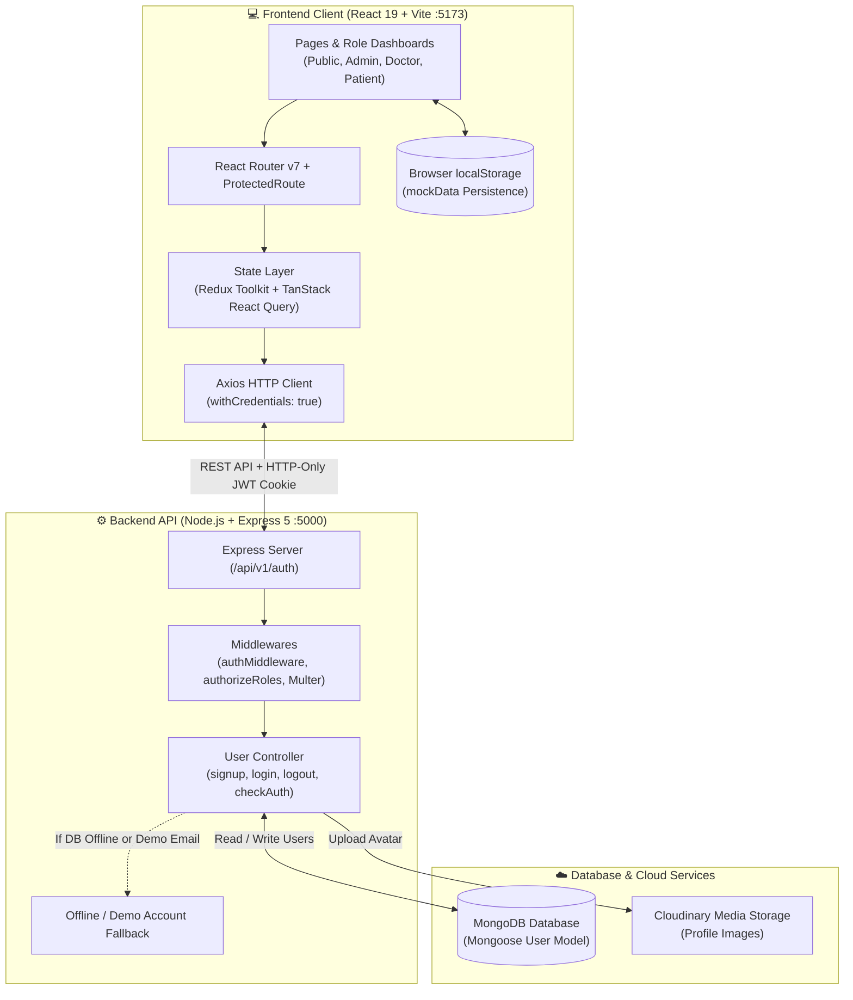
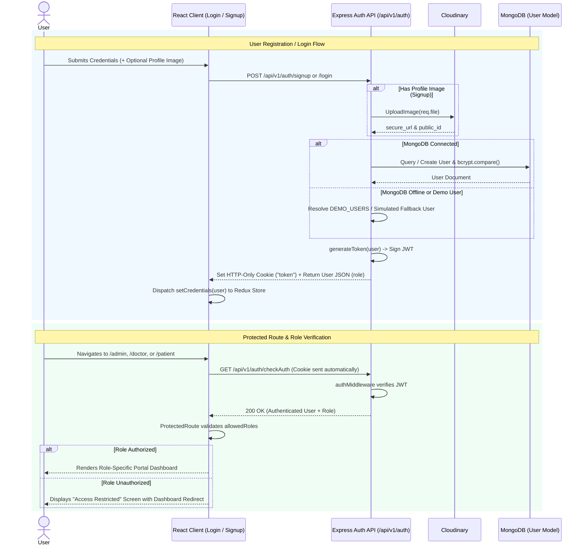
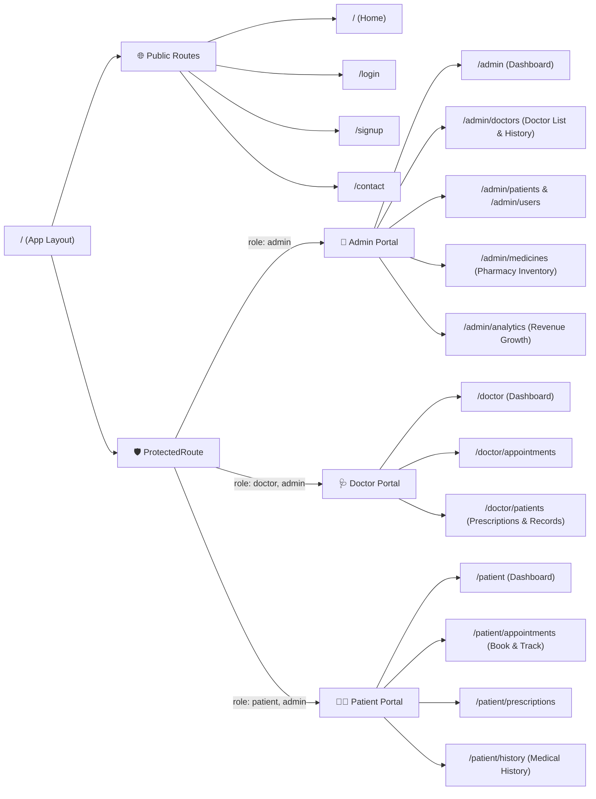

# 🏥 MEDICARE — Healthcare & Hospital Management Portal

**MEDICARE** is a full-stack, role-based Healthcare and Hospital Management web application designed to streamline interactions between **Administrators**, **Doctors**, and **Patients**. It combines a responsive React 19 frontend with an Express 5 & MongoDB REST API, complete with JWT cookie authentication, Cloudinary image uploads, interactive analytics, and an intelligent offline/demo fallback mode.

---

## 📖 About the Project

MEDICARE provides a unified digital healthcare ecosystem divided into public informational pages and three dedicated, role-protected portals:

### 🔐 Key Highlights & Capabilities
- **Role-Based Access Control (RBAC)**: Strict route protection on both the client (`ProtectedRoute`) and server (`authMiddleware` + `authorizeRoles`) for `admin`, `doctor`, and `patient` roles.
- **Resilient Hybrid/Offline Mode**: Automatically detects MongoDB connectivity across Docker and local environments. If MongoDB is unreachable, the server and client gracefully fall back to pre-configured demo accounts and browser `localStorage` persistence so the portal remains 100% functional for demos and testing.
- **Admin Portal (`/admin/*`)**:
  - **Executive Dashboard**: Real-time KPIs, consultation statistics, and payment/revenue charts.
  - **Doctor & Patient Directories**: Manage registered doctors and patients and inspect full consultation and medical histories (`DoctorHistoryModal`, `PatientHistoryModal`).
  - **Medicine & Pharmacy Inventory**: Track stock levels, unit prices, and categories; add, update, or remove medicines (`AddMedicineModal`).
  - **Revenue & Growth Analytics**: Monthly revenue breakdowns, consultation trends, and revenue stream distribution (`GrowthAnalyticsChart`).
- **Doctor Portal (`/doctor/*`)**:
  - **Clinical Dashboard**: Overview of daily appointments, active patients, and consultation metrics.
  - **Appointment Management**: View upcoming patient bookings and update appointment statuses (`Confirmed`, `Completed`, `Pending`, `Cancelled`).
  - **Patient Care & Prescriptions**: Inspect patient medical histories and issue digital prescriptions (`PrescriptionModal`).
- **Patient Portal (`/patient/*`)**:
  - **Personal Health Dashboard**: Summary of upcoming visits, active prescriptions, and health records.
  - **Book Appointments**: Schedule consultations with specialists (`BookAppointmentModal`).
  - **Prescriptions & Medical History**: View prescribed medications, dosages, past diagnoses, and treatment records.

---

## 🛠️ Tech Stack

### Frontend (`/client`)
| Technology | Version | Purpose |
| :--- | :--- | :--- |
| **React** | `^19.2.4` | Component-based UI library |
| **Vite** | `^8.3.0` | Next-generation frontend build tool & dev server |
| **Tailwind CSS** | `^4.2.2` | Utility-first CSS styling (`@tailwindcss/vite`) |
| **React Router DOM** | `^7.14.1` | Client-side routing and nested role-protected layouts |
| **Redux Toolkit & React-Redux** | `^2.11.2` | Global authentication state management (`authSlice`) |
| **TanStack React Query** | `^5.100.10` | Async server-state caching, mutations, and auth verification |
| **Axios** | `^1.16.0` | HTTP client configured with credentials/cookie support |
| **Lucide React** | `^1.47.0` | Medical and UI iconography |

### Backend (`/server`)
| Technology | Version | Purpose |
| :--- | :--- | :--- |
| **Node.js & Express** | `^5.2.1` | REST API framework |
| **MongoDB & Mongoose** | `^9.6.2` | NoSQL database and schema modeling (`User` model) |
| **JSON Web Token (`jsonwebtoken`)** | `^9.0.3` | Stateless session token generation & verification |
| **bcryptjs** | `^3.0.3` | Password hashing (12 salt rounds via Mongoose pre-save hook) |
| **Cloudinary** | `^2.10.0` | Cloud storage for user and doctor profile images |
| **Multer** | `^2.1.1` | `multipart/form-data` file upload handling middleware |
| **cookie-parser & cors** | `^1.4.7` / `^2.8.6` | HTTP-only cookie parsing & Cross-Origin Resource Sharing |

### DevOps & Utilities
| Tool | Purpose |
| :--- | :--- |
| **Docker & Docker Compose** | Multi-container orchestration for `client` (`:5173`) and `server` (`:5000`) |
| **Python (`upload_to_drive.py`)** | Utility script using Google Drive API v3 to back up or upload project files |

---

## 📂 Folder Structure

```text
MEDICARE/
├── docker-compose.yml                  # Multi-container setup for client (5173) & server (5000)
├── upload_to_drive.py                  # Google Drive API v3 file upload utility script
│
├── client/                             # React 19 + Vite Frontend Application
│   ├── Dockerfile                      # Node 20 Alpine container definition for Vite dev server
│   ├── index.html                      # Root HTML template
│   ├── package.json                    # Frontend dependencies and scripts
│   ├── vite.config.js                  # Vite bundler & Tailwind CSS v4 configuration
│   ├── public/                         # Static public assets (favicon.svg, icons.svg)
│   └── src/
│       ├── main.jsx                    # Application entry point (Redux Provider, QueryClient, Router)
│       ├── App.jsx                     # Root layout shell with Navbar & Outlet
│       ├── index.css                   # Global styles and Tailwind imports
│       ├── api/
│       │   ├── axiosClient.js          # Pre-configured Axios instance (baseURL, withCredentials)
│       │   └── authApi.js              # TanStack Query hooks (useLogin, useSignup, useLogout, useCheckAuth)
│       ├── assets/                     # Images and SVG assets (hero.png, etc.)
│       ├── components/
│       │   ├── Navbar.jsx              # Role-aware responsive navigation bar
│       │   ├── ProtectedRoute.jsx      # Role-based route guard (Admin / Doctor / Patient)
│       │   ├── AdminStatCard.jsx       # KPI summary card component
│       │   ├── PaymentChart.jsx        # Financial & payment visualization component
│       │   └── panels/                 # Shared dashboard layout & interactive modals
│       │       ├── PanelLayout.jsx         # Unified sidebar + header layout for Admin/Doctor/Patient
│       │       ├── AddMedicineModal.jsx    # Modal for adding/editing pharmacy inventory
│       │       ├── BookAppointmentModal.jsx# Modal for patients to book doctor appointments
│       │       ├── DoctorHistoryModal.jsx  # Modal displaying a doctor's consultation history
│       │       ├── GrowthAnalyticsChart.jsx# Interactive revenue & patient growth chart
│       │       ├── PatientHistoryModal.jsx # Modal displaying a patient's medical history
│       │       └── PrescriptionModal.jsx   # Modal for doctors to issue prescriptions
│       ├── data/
│       │   └── mockData.js             # Centralized seed data & localStorage persistence helpers
│       ├── Page/
│       │   ├── Home.jsx                # Public landing page
│       │   ├── Login.jsx               # User login page with quick demo-role login support
│       │   ├── Signup.jsx              # Registration page with profile photo upload (Patient/Doctor)
│       │   ├── Contact.jsx             # Emergency & hospital contact page
│       │   ├── Admin/                  # Admin Portal Pages
│       │   │   ├── AdminDashboard.jsx      # System-wide overview & stats
│       │   │   ├── Doctorlist.jsx          # Manage doctors & view consultation logs
│       │   │   ├── UsersList.jsx           # Manage patients & user accounts
│       │   │   ├── MedicineList.jsx        # Pharmacy stock & medicine management
│       │   │   └── RevenueGrowth.jsx       # Financial analytics & growth metrics
│       │   ├── Doctor/                 # Doctor Portal Pages
│       │   │   ├── DoctorDashboard.jsx     # Doctor's daily summary & metrics
│       │   │   ├── DoctorAppointments.jsx  # Manage scheduled patient appointments
│       │   │   └── DoctorPatients.jsx      # Assigned patients & prescription issuance
│       │   └── Patient/                # Patient Portal Pages
│       │       ├── PatientDashboard.jsx    # Personal health summary & quick actions
│       │       ├── PatientAppointments.jsx # View & book appointments
│       │       ├── PatientPrescriptions.jsx# Active & past prescriptions
│       │       └── PatientMedicalHistory.jsx# Chronological medical & diagnosis records
│       ├── redux/
│       │   ├── store.js                # Redux store configuration
│       │   └── authSlice.js            # Auth state slice (user, status, error)
│       └── Route/
│           └── index.jsx               # React Router v7 route definitions & role guards
│
└── server/                             # Express 5 + MongoDB Backend API
    ├── Dockerfile                      # Node 20 Alpine container with nodemon live reload
    ├── package.json                    # Backend dependencies
    ├── server.js                       # Express app initialization, CORS, middleware & routes
    ├── config/
    │   └── db.js                       # Multi-URI MongoDB connection handler with safe offline fallback
    ├── controller/
    │   └── user.controller.js          # Auth logic (signup, login, logout, checkAuth) & demo users
    ├── middleware/
    │   ├── auth.middleware.js          # JWT verification (cookies & Bearer header)
    │   ├── role.middleware.js          # Role authorization guard (authorizeRoles)
    │   └── upload.middleware.js        # Multer memory/file upload configuration
    ├── model/
    │   └── user.model.js               # Mongoose User schema with bcrypt password hashing
    ├── router/
    │   └── user.routes.js              # Auth API routes (/api/v1/auth/*)
    └── utils/
        ├── cloudinary.js               # Cloudinary SDK configuration
        ├── upload-image.js             # Helper to upload profile images to Cloudinary
        ├── delete-image.js             # Helper to remove images from Cloudinary
        └── generate-token.js           # JWT signing & HTTP-only cookie attachment
```

---

## 📊 System Architecture & Mermaid Graphs

### 1. High-Level System Architecture



---

### 2. Authentication & Role-Based Access Workflow



---

### 3. Application Routing & Portal Hierarchy



---

## 🔌 API Endpoints

All authentication and user verification endpoints are prefixed with `/api/v1/auth`:

| Method | Endpoint | Middleware | Description |
| :--- | :--- | :--- | :--- |
| `GET` | `/` | None | Health check endpoint (`{ status: "healthy" }`) |
| `POST` | `/api/v1/auth/signup` | `upload.single("image")` | Register a new `patient` or `doctor` with optional avatar upload |
| `POST` | `/api/v1/auth/login` | None | Authenticate user via email & password and set JWT cookie |
| `POST` | `/api/v1/auth/logout` | None | Clear the `token` HTTP-only cookie |
| `GET` | `/api/v1/auth/checkAuth` | `authMiddleware` | Verify active JWT session and return current user profile |
| `GET` | `/api/v1/auth/me` | `authMiddleware` | Alias for `/checkAuth` to fetch current authenticated user |
| `GET` | `/api/v1/auth/verify` | `authMiddleware` | Alias for `/checkAuth` |
| `GET` | `/api/v1/auth/admin-check` | `authMiddleware`, `authorizeRoles("admin")` | Verify admin-level authorization |

---

## 🚀 Getting Started

### 1. Environment Configuration

Create a `.env` file in `/server`:
```env
PORT=5000
MONGO_URI=mongodb://localhost:27017/MEDICARE
JWT_SECRET_TOKEN=your_jwt_secret_key
CLIENT_URL=http://localhost:5173
CLOUDINARY_CLOUD_NAME=your_cloud_name
CLOUDINARY_API_KEY=your_api_key
CLOUDINARY_API_SECRET=your_api_secret
```

Create a `.env` file in `/client`:
```env
VITE_API_URL=http://localhost:5000
```

### 2. Run with Docker Compose (Recommended)

```bash
docker-compose up --build
```
- **Frontend Client**: [http://localhost:5173](http://localhost:5173)
- **Backend API**: [http://localhost:5000](http://localhost:5000)

### 3. Run Locally Without Docker

**Start the Backend Server:**
```bash
cd server
npm install
node server.js
```

**Start the Frontend Client:**
```bash
cd client
npm install
npm run dev
```

---

## 🧪 Built-in Demo Accounts

You can log in immediately using the pre-configured demo accounts (works both with and without MongoDB running):

| Role | Email | Password | Portal Route |
| :--- | :--- | :--- | :--- |
| **Admin** | `admin@medicare.com` | *Any non-empty password* | `/admin` |
| **Doctor** | `doctor@medicare.com` | *Any non-empty password* | `/doctor` |
| **Patient** | `patient@medicare.com` | *Any non-empty password* | `/patient` |
